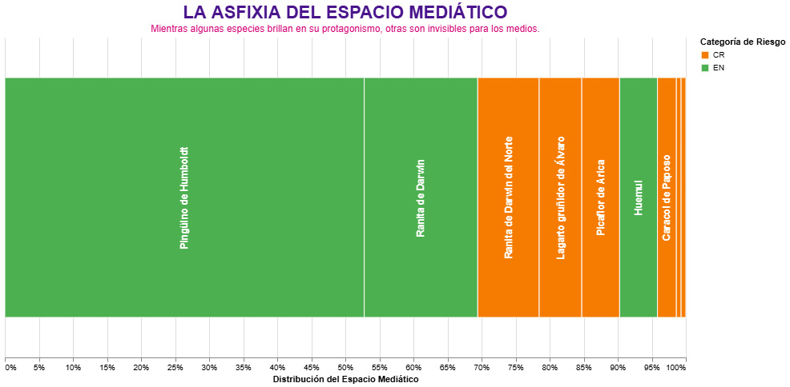

# La asfixia del espacio mediático: El silencio de las especies invisibles

¿Alguna vez has sentido que tienes un hermano o hermana que se roba toda la atención en las reuniones familiares mientras tú pasas casi desapercibido? Para la **ranita de Darwin del norte** (*Rhinoderma rufum*), esta no es una suposición, sino su realidad diaria frente a su pariente del sur. Al analizar las noticias de los **últimos seis meses**, descubrimos que mientras la ranita de Darwin del sur es protagonista en el 100% de las noticias en las que ha tenido mención en el periodo de tiempo analizado, su "hermana" del norte **es protagonista en solo 4 de las 13 noticias en las que aparece**

Este fenómeno se explica mediante una idea muy sencilla: el **espacio mediático** es como una habitación con un tamaño fijo; si alguien entra con un megáfono y ocupa mucho lugar, los demás se quedan sin sitio para ser escuchados. En nuestra prensa, ese "megáfono" lo tiene el **pingüino de Humboldt**, quien acapara el centro de la escena en las **76 noticias** donde se le nombra. A esto le llamamos **asfixia del espacio mediático**: cuando unas pocas especies muy famosas se quedan con toda la atención, las demás terminan siendo invisibles para el público.

Esta falta de equilibrio genera que grantidad de especies en Riesgo Crítico, vivan en las sombras de la información. Por ejemplo, mientras el pingüino brilla en las portadas, insectos como el **borrachito** o aves como el **picaflor de Juan Fernández** registran apenas **una mención** en las noticias de los últimos seis meses, y en ninguno de esos casos logran ser el tema principal de la nota. Incluso el **caracol de Paposo**, que se encuentra en Peligro Crítico, logra ser el **protagonista en solo 1 de las 4 noticias** que logran publicarse sobre él.

Entender esta diferencia es fundamental porque la visibilidad en los medios ayuda a que las personas conozcan y protejan nuestra biodiversidad. Si el relato nacional se concentra siempre en los mismos personajes, corremos el riesgo de olvidar a muchas otras especies que también necesitan nuestra atención. Al final del día, el **muro de la invisibilidad** nos enseña que para proteger a nuestra fauna, primero tenemos que aprender a darle espacio a todos en nuestra conversación diaria, permitiendo que las "hermanas invisibles" también tengan la oportunidad de contar su historia.