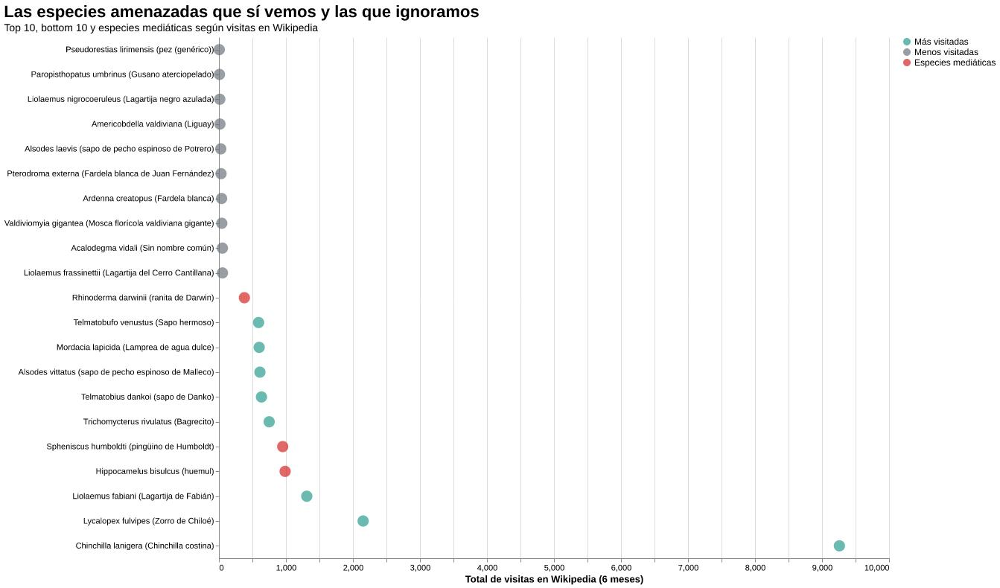

## Las especies amenazadas que sí vemos y las que ignoramos
Algunas especies logran instalarse en la memoria colectiva incluso sin haber sido vistas nunca en persona. Basta escuchar sus nombres para imaginarlas: el huemul cruzando montañas nevadas del sur de Chile; el pingüino de Humboldt desplazándose entre rocas costeras del norte; o la pequeña ranita de Darwin, anfibio diminuto cuyo método de reproducción parece inventado por la ciencia ficción. Hay animales que, por distintas razones, consiguen permanecer presentes dentro del imaginario cultural.

Otras especies no tienen esa suerte.

Mientras ciertos animales acumulan miles de visitas en Wikipedia, existen especies amenazadas que sobreviven en una invisibilidad digital casi absoluta. Algunas apenas registran búsquedas durante meses, pese a encontrarse igualmente en categorías de conservación críticas. Sus nombres rara vez aparecen en campañas ambientales, medios de comunicación o conversaciones cotidianas.

Dentro de esta diferencia también habita una forma de entender la conservación. No todos los animales logran transformarse en símbolos reconocibles de la biodiversidad chilena. Algunos poseen características que facilitan su difusión pública: cuerpos grandes, apariencias llamativas o nombres fáciles de recordar. Otros permanecen relegados a descripciones científicas difíciles de pronunciar y fotografías que pocas veces circulan fuera de espacios especializados.

Hippocamelus bisulcus, conocido comúnmente como huemul, es uno de los casos más reconocibles. Su presencia en el escudo nacional lo convirtió en un símbolo de identidad incluso para personas que jamás lo han visto fuera de ilustraciones escolares o campañas institucionales. Actualmente se encuentra en peligro de extinción y habita principalmente zonas australes de Chile y Argentina, donde las poblaciones existentes continúan disminuyendo debido a la pérdida de hábitat y la fragmentación territorial.

Algo similar ocurre con Spheniscus humboldti, el pingüino de Humboldt. Su apariencia fácilmente reconocible y la frecuente utilización de su imagen en contenidos educativos y turísticos han contribuido a mantenerlo dentro de las especies más visibles del país. Sin embargo, también enfrenta amenazas importantes relacionadas con la actividad pesquera, el cambio climático y la alteración de ecosistemas costeros.

Pero mientras algunas especies consiguen permanecer dentro de la conversación pública, muchas otras sobreviven lejos de cualquier atención. Peces, insectos, anfibios y pequeños reptiles aparecen dentro de registros científicos y listados de conservación, aunque prácticamente no existen dentro del espacio digital cotidiano. Algunas de estas especies reciben tan pocas visitas en Wikipedia que sus nombres pasan desapercibidos incluso entre quienes se interesan por biodiversidad.

La atención digital no determina por sí sola la supervivencia de una especie, pero sí permite observar cómo funciona el interés público frente a la conservación. Wikipedia, en este caso, opera como una especie de termómetro cultural: las visitas reflejan qué animales circulan con mayor frecuencia en contenidos educativos, medios de comunicación, redes sociales o campañas ambientales.

Dentro de las más de 200 especies consideradas en la base de datos trabajada para esta visualización, la diferencia entre las especies más visibles y las menos conocidas resulta evidente. Mientras algunas concentran gran parte de las búsquedas, muchas otras permanecen al margen de la conversación pública pese a compartir el mismo nivel de amenaza.

Cada especie amenazada posee una historia propia, una forma particular de habitar el territorio y una posición específica dentro del ecosistema. Sin embargo, no todas ocupan el mismo lugar dentro de la memoria colectiva. Algunas logran convertirse en emblemas reconocibles de la conservación chilena; otras desaparecen silenciosamente incluso antes de que la mayoría aprenda sus nombres.