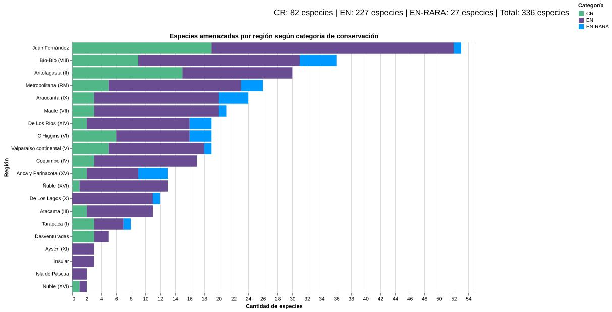

# Regio: especies en peligro en Chile

Cuando se habla de cualquier especie, no solo se hace referencia al nombre común con el que la mayoría de las personas la conoce, sino también a su raíz etimológica y a su nombre científico. En esa historia de nombres también habita una forma de entender el territorio: la palabra región, del latín _regio_, alude a una zona, un espacio, una porción de mundo que organiza la vida que contiene.

A partir de esas clasificaciones es posible acercarse a la flora y fauna de un país incluso sin una imagen; a veces, la descripción basta. _Sclerostomulus nitidus_, del griego _skleros_, que significa “duro”, característico de esta criatura; del griego _stoma_, que refiere a la boca, y _ulus_, por lo pequeña que es. Por su parte, del latín _nitidus_ describe aquello que es brillante y elegante, como el color negro resplandeciente de este insecto.

_Sclerostomulus_ se vincula comúnmente a la familia Lucanidae, escarabajos cuya mandíbula se desarrolla de forma tal que recuerda a cuernos. Su nombre común es la evidencia palpable de la forma en que se alimenta el Borrachito, quien extrae la savia fermentada de los árboles, lo que en muchas ocasiones provoca que estos caigan al suelo, como si se tratara de una verdadera persona ebria que, después de beberse varias cajas de vino tinto Gato de un litro, comienza a caminar torpemente hasta caer rendida y volver a las andadas al día siguiente.

Este simpático espécimen es un ejemplar único en el mundo. Vive en una zona extremadamente restringida: el cerro Poqui, en la Región del Libertador General Bernardo O’Higgins. Actualmente se encuentra en peligro crítico de extinción, la categoría más alta de vulneración según los criterios de la Unión Internacional para la Conservación de la Naturaleza. Junto a otros 69 ejemplares de distinto tipo, conforma el total de especies que en Chile están _ad portas_ de la extinción.

Y aunque el Borrachito se presenta como un habitante de un solo lugar, no todos los casos son así; al menos no el de _Mordacia lapicida_, también conocida como lamprea de agua dulce, un pez sin mandíbula que se remonta al período Paleozoico y que, por ello, es considerado un fósil viviente, cuya forma es similar a una anguila.

Este pez agnato habita aguas donde podría cruzarse sin advertencia. En la cuenca de Los Lagos, en sectores como el río Futaleufú, puede encontrarse desplazándose entre corrientes de agua dulce. Si un día estás en estos lugares, puede que este pez atraviese tus pies y los roce con suavidad. Recomendación: no lo pises ni lo patees, porque aunque existen ejemplares en varias regiones de Chile, son pocos. Tan pocos, que esta especie inofensiva para los humanos se encuentra en peligro de extinción.

Como estos dos, hay otros 222 animales en Chile que se encuentran en estas categorías, así como también en peligro raro de extinción. Dentro de este conjunto, los sapos destacan por su diversidad de colores, manchas y texturas, pero el _Alsodes tumultuosus_ es un anfibio inigualable: sin importar el clima, anda con sostén los 365 días del año, uno que, además, tiene espinas. Todos los machos presentan así sus estructuras pectorales para poder adherirse a la hembra que escojan y sujetarse a ella como si no hubiera un mañana.

Cada especie tiene una historia asombrosa, pero hoy muchas de estas se ven amenazadas por la limitada cantidad de ejemplares que existe de cada una. Incluso cuando se agrupan por región y el número llega a 336 animales, siguen siendo cifras bajas que reflejan la vulnerabilidad en la que se encuentran las especies endémicas de nuestro país.